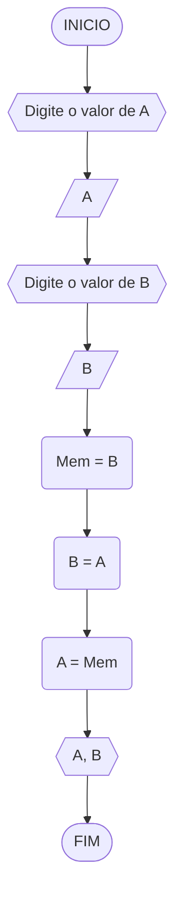
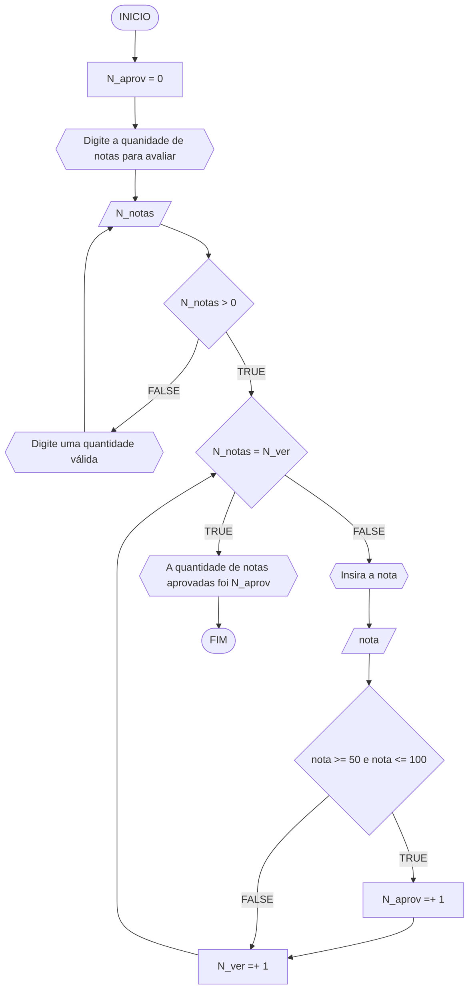
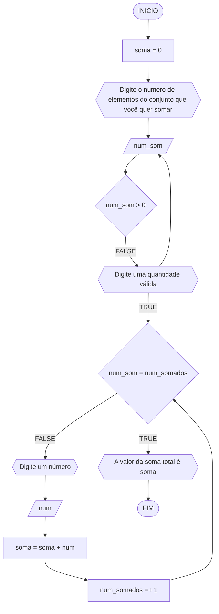
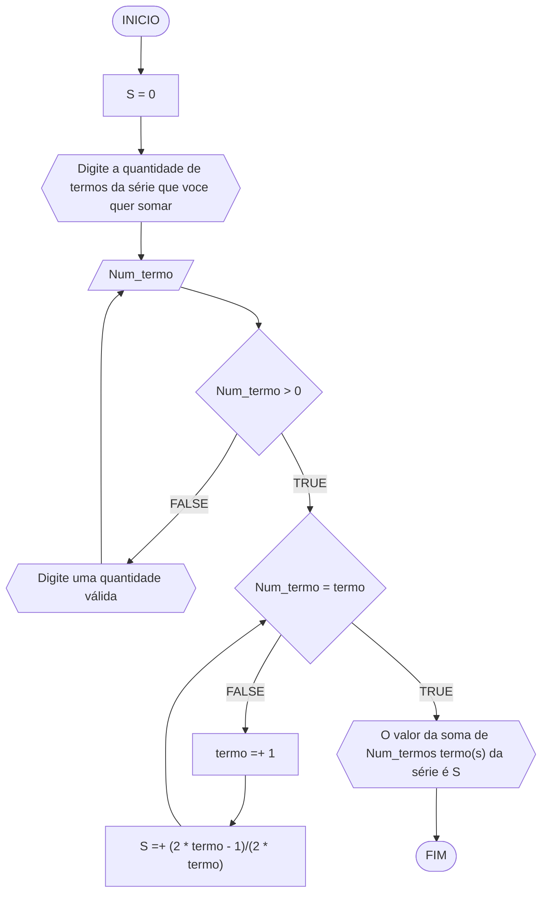
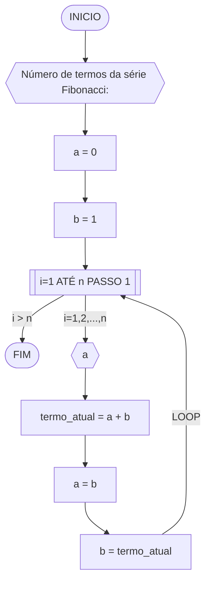
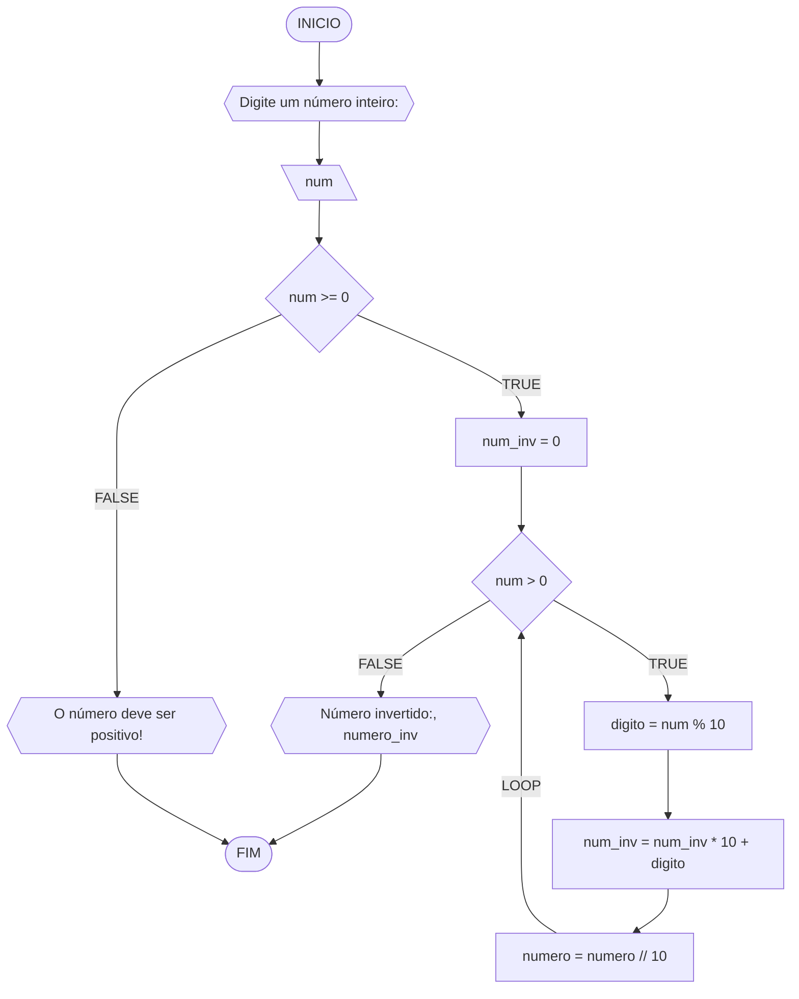

**Curso:** preencha com seus dados <br>
**Disciplina:** preencha com seus dados <br>
**Código/Turma:** preencha com seus dados <br>
**Professor:** Ricardo Carubbi <br>
**Data:** preencha com a data de envio <br>
**Aluno(a):** preencha com seus dados <br>
**Matrícula:** preencha com seus dados <br>

**1a chamada (Sim/Não):** preencha com a opção correta <br>
**2a chamada (Sim/Não):** preencha com a opção correta

# Avaliação Diagnóstica 1

## Normas e exigências

Avaliação diagnóstica (**AD**) consiste em exercícios ou projetos desenvolvidos em grupo ao longo da disciplina. <br>
A primeira avaliação diagnóstica (**AD1**) será composta por exercícios e equivale a 30% da nota da primeira avaliação (**AV1**).

Segue abaixo a expressão para o cálculo da **AV1**, sendo sendo **AF1** equivale a primeira avaliação formativa e **AD1**, a primeira avaliação diagnóstica.

$$AV_1 = AF_1 \times 0,30 + AD_1 \times 0,70$$

A **AD1** é formada pela entrega dos exercícios (**EX1**) na data prevista e apresentação (**AP1**) de um dos exercícios escolhido pelo professor.
Segue abaixo a expressão para o cálculo da **AD1**.

$$AD_1 = (EX1_1 + AP_1)/2 $$

A **EX1** é avaliada mediante a **correção dos exercícios**, sendo a avaliação no intervalo de 0% (não atende a questão), 50% (atende parcialmente) e 100% (atende em sua totalidade).
Por exemplo, se o exercício equivale a 2 pontos e sua correção atente parcialmente a questão, então sua avaliação deste exercício será 1 ponto.

A **AP1** é avaliada mediante aos pré-requisitos de **clareza, organização e domínio do conteúdo**. Portanto, o aluno deve demonstrar um bom entendimento do algoritmo, explicando seus princípios fundamentais, seu propósito e como ele funciona passo a passo. <br>

A avaliação da **AP1** é apenas considerada no intervalo de 0% (não atende os pré-requisitos), 25% (pouco atende os pré-requisitos), 50% (atende de forma mediana os pré-requisitos), 75% (atende de forma razoável os pré-requisitos) e 100% (atende em a totalidade dos pré-requisitos).
Por exemplo, se na apresentação do exercício, o aluno atenter de forma razoável a questão, então sua avaliação da apresentação será 7.5 pontos.

## Datas
- Entrega da primeira avaliação formativa (**AF1**) composta pelas listas de exerciícios 1, 2 e 3: 21/03/24
- Entrega dos exercícios da primeira avaliação diagnóstica (**EX1**): 21/03/24
- Apresentação da primeira avaliação diagnóstica (**AP1**): 21/03/24

## Lista de questões

### Questão 1 - Troca dos valores de duas variáveis (1 ponto)

Dadas duas variáveis, $a$ e $b$, implemente e teste um algoritmo para trocar os valores atribuídos a elas.

#### Descrição geral do algoritmo

1. Guardar o valor original da variável $a$ em uma variável auxiliar $aux$;
2. Atribuir à variável $a$ o valor original da variável $b$;
3. Atribuir à variável $b$ o valor original da variável $a$, que está armazenado na variável auxiliar $aux$.
4. Exibir os novos valores de $a$ e $b$.

#### Fluxograma


#### Pseudocódigo (1 ponto)



#### Teste de mesa

| A  | B | Mem = B | B = A | A = Mem | Saida |
| -- | -- | -- | -- | -- | -- |
| 10 | 4 | 4 | 10 | 4 | 4, 10

### Questão 2 - Contagem (1 ponto)

Dado um conjunto $n$ de notas de alunos em um exame, implemente e teste um algoritmo para fazer uma contagem $cont$ do número de alunos que foram aprovados no exame. 
Será considerado aprovado o aluno que tirar $nota$ 50 ou maior (no intervalo de 0 a 100).

#### Descrição geral do algoritmo

1. Obter o número de notas $n$ a serem processadas;
2. Inicializar a contagem $cont$ com zero;
3. Enquanto houver notas a serem processadas, fazer repetidamente:
    - obter a próxima nota;
    - se a nota for suficiente para passar no exame ($n ≥ 50$) então adicionar 1 (um) à contagem $cont$;
4. Exibir a contagem $cont$ (número total de aprovações).

#### Fluxograma 01
Fluxograma conforme descrição do algoritmo acima, usando o loop ENQUANTO.


#### Pseudocódigo 01 (1 ponto)

```
Algoritimo aprovação
DECLARE N_ver, N_aprov, N_notas, i: Int
	notas: Float
INICIO
N_aprov = 0 
ESCREVA "Digite a quanidade de notas para avaliar"
LEIA N_notas
ENQUANTO N_notas <= 0 REPITA
	ESCREVA "Digite uma quantidade válida"
	LEIA N_notas
PARA N_ver DE 1 ATÉ N_notas FAÇA [PASSO 1]
	ESCREVA "Insira a nota"
	LEIA nota
	SE nota >= 50 E nota <= 100
		N_aprov =+ 1
		N_ver =+ 1
	SENÃO
		N_ver =+ 1
	FIM_SE
FIM_PARA
ESCREVA "A quantidade de notas aprovadas foi", N_aprov
FIM_ALGORÍRIMO
```

#### Teste de mesa 01
##### Chat GPT
| Iteração | Ação                                              | Entrada/Saída  | N_aprov | N_ver |
|----------|---------------------------------------------------|----------------|---------|-------|
|         | **Inicialização das Variáveis**                   |                | 0       | 0     |
|         | **Entrada do Número de Notas**                    | 5              |         |       |
| 1        | Mensagem: "Insira a nota"                         |                |         |       |
|          | Entrada: nota                                     | 70             |         |       |
|          | Condição SE: 70 >= 50 e 70 <= 100 (verdadeiro)   |                |         |       |
|          |  N_aprov += 1                                    |                | 1       | 1     |
|          |  N_ver += 1                                      |                |         | 1     |
| 2        | Mensagem: "Insira a nota"                         |                |         |       |
|          | Entrada: nota                                     | 30             |         |       |
|          | Condição SE: 30 >= 50 e 30 <= 100 (falso)        |                |         |       |
|          |  N_ver += 1                                      |                |         | 2     |
| 3        | Mensagem: "Insira a nota"                         |                |         |       |
|          | Entrada: nota                                     | 85             |         |       |
|          | Condição SE: 85 >= 50 e 85 <= 100 (verdadeiro)   |                |         |       |
|          |  N_aprov += 1                                    |                | 2       | 3     |
|          |  N_ver += 1                                      |                |         | 3     |
| 4        | Mensagem: "Insira a nota"                         |                |         |       |
|          | Entrada: nota                                     | 95             |         |       |
|          | Condição SE: 95 >= 50 e 95 <= 100 (verdadeiro)   |                |         |       |
|          |  N_aprov += 1                                    |                | 3       | 4     |
|          |  N_ver += 1                                      |                |         | 4     |
| 5        | Mensagem: "Insira a nota"                         |                |         |       |
|          | Entrada: nota                                     | 40             |         |       |
|          | Condição SE: 40 >= 50 e 40 <= 100 (falso)        |                |         |       |
|          |  N_ver += 1                                      |                |         | 5     |
| -        | **Saída de Resultados**                           |                |         |       |
| -        | Mensagem: "A quantidade de notas aprovadas foi 3"|                |         |       |

### Questão 3 - Soma de um conjunto de números (1 ponto)

Dado um conjunto de $n$ números, implemente e teste um algoritmo para calcular a soma desses números. <br>
Aceite apenas $n$ maior ou igual a zero.

#### Descrição geral do algoritmo

1. Obter a quantidade de números $n$ a serem somados.
2. Inicializar a variável $soma$ com 0 (zero).
3. Enquanto menos do que $n$ números tiverem sido somados, fazer repetidamente:
    - obter o próximo número $i$;
    - calcular a soma atual, adicionando o número $i$ obtido à soma mais recente;
4. Exibir a soma dos $n$ números

#### Fluxograma



#### Pseudocódigo (1 ponto)
```
Algoritmo soma_de_valores
DECLARE num_somados, num_soma: Int
	num, soma: Float
INICIO
soma = 0
ESCREVA "Digite o número de elementos do conjunto que você quer somar"
LEIA num_soma
ENQUANTO num_soma <= 0 FAÇA
	ESCREVA "Digite uma quantidade válida"
	LEIA num_soma
FIM_ENQUANTO
PARA num_somados DE 1 até Num_soma [PASSO 1] FAÇA
	ESCREVA "Digite um número"
	LEIA num
	soma =+ num
FIM_PARA
ESCREVA "O valor da soma total é", soma
FIM_ALGORITMO
```

#### Teste de mesa
##### Chat GPT

| Iteração | Ação                                              | Entrada/Saída | soma | num_somados |
|----------|---------------------------------------------------|---------------|------|-------------|
| -        | **Inicialização das Variáveis**                   |               | 0    | 0           |
| -        | **Entrada do Número de Elementos a Somar**        | 7             |      |             |
| 1        | Mensagem: "Digite um número"                      |               |      |             |
|          | Entrada: num                                      | 0.5           |      |             |
|          |  soma += num                                     |               | 0.5  |             |
|          |  num_somados += 1                                |               |      | 1           |
| 2        | Mensagem: "Digite um número"                      |               |      |             |
|          | Entrada: num                                      | -1.25         |      |             |
|          |  soma += num                                     |               | -0.75|             |
|          |  num_somados += 1                                |               |      | 2           |
| 3        | Mensagem: "Digite um número"                      |               |      |             |
|          | Entrada: num                                      | 2.75          |      |             |
|          |  soma += num                                     |               | 2    |             |
|          |  num_somados += 1                                |               |      | 3           |
| 4        | Mensagem: "Digite um número"                      |               |      |             |
|          | Entrada: num                                      | 0             |      |             |
|          |  soma += num                                     |               | 2    |             |
|          |  num_somados += 1                                |               |      | 4           |
| 5        | Mensagem: "Digite um número"                      |               |      |             |
|          | Entrada: num                                      | -3.5          |      |             |
|          |  soma += num                                     |               | -1.5 |             |
|          |  num_somados += 1                                |               |      | 5           |
| 6        | Mensagem: "Digite um número"                      |               |      |             |
|          | Entrada: num                                      | 1.75          |      |             |
|          |  soma += num                                     |               | 0.25 |             |
|          |  num_somados += 1                                |               |      | 6           |
| 7        | Mensagem: "Digite um número"                      |               |      |             |
|          | Entrada: num                                      | -2.25         |      |             |
|          |  soma += num                                     |               | -2    |             |
|          |  num_somados += 1                                |               |      | 7           |
| -        | **Saída de Resultados**                           |               |      |             |
| -        | Mensagem: "O valor da soma total é -2"            |               |      |             |


### Questão 4 - Cálculo de uma série (1 ponto)

Dado um conjunto de $n$ termos da série, implemente e teste um algoritmo para calcular o valor de S, conforme definido abaixo:

$$ S = \frac{1}{2} + \frac{3}{4} + \frac{5}{6} + \frac{7}{8} + \dots $$

#### Descrição geral do algoritmo

1. Obter o número de termos $n$;
2. Inicializar a variável $S$ com 0 (zero).
3. Iterar o valor de $n$ na variável $i$ iniciando com 0 (zero), de acordo com as instruções abaixo:
    - calcular o numerador na variável $numerador$;
    - calcular o denominador  na variável $denominador$;;
    - calcular o termo da série na variável $termo$, onde $termo = numerador/denominador$;
    - adicionar esse termo à variável $S$.
4. Exibir o valor da série $S$.

#### Fluxograma



#### Pseudocódigo (1 ponto)

```
Algoritmo soma_da_serie
DECLARE Num_termo, termo: Int
	S: Float
INICIO
S = 0
ESCREVA "Digite a quantidade de termos da série que você quer somar"
LEIA Num_termo // 3 
ENQUANTO Num_termo < 0 FAÇA
	ESCREVA "Digite uma quantidade válida"
	LEIA Num_termo
FIM_ENQUANTO
PARA termo DE 1 ATÉ Num_termo [PASSO 1] FAÇA
	S =+ (2 * termo - 1)/(2 * termo)
FIM_PARA
ESCREVA "O valor da soma de", Num_termo, "termo(s) da série é", S
FIM_ALGORITMO
```

#### Teste de mesa (0.25 ponto)
##### Chat GPT

| Iteração | Ação                                                 | Entrada/Saída | S     |
|----------|------------------------------------------------------|---------------|-------|
| -        | **Inicialização das Variáveis**                      |               | 0     |
| -        | **Entrada do Número de Termos da Série**            |               |       |
| 1        | Mensagem: "Digite a quantidade de termos da série"  |               |       |
|          | Entrada: Num_termo                                   |               | -3    |
|          |                                                      |               |       |
| 2        | **Verificação do Número de Termos**                  |               |       |
|          | Enquanto Num_termo < 0 FAÇA                         |               |       |
|          |   Mensagem: "Digite uma quantidade válida"          |               |       |
|          |   Entrada: Num_termo                                 |               |       |
|          | FIM_ENQUANTO                                        |               |       |
|          |                                                      |               |       |
| -        | **Saída de Resultados (Nenhum Cálculo Realizado)**  |               |       |
| -        | Mensagem: "O valor da soma de -3 termo(s) da série é" |             |       |
|          |                  0                                   |               |       |


### Questão 5 - Cálculo fatorial (2 pontos)

Dado um número $n$, implemente e teste um algoritmo para calcular o fatorial de $n$ (escrito como $n!$), onde $n ≥ 0$.

#### Descrição geral do algoritmo

1. Obter o número $n$, onde $n \geq 0$;
2. Inicializar a variável $fator$ com 1 (um) para armazenar o resultado do cálculo do fatorial;
3. Iterar o valor de $n$ na variável $i$, ou seja, executar $n$ vezes, as instruções abaixo:
    - Incrementar o valor atual $fator$ multiplicando pelo valor de $i$;
4. Exibir o resultado ($n!$).

#### Fluxograma

```mermaid
flowchart TD
A([INICIO]) --> B[fato = 1]
B --> R[n_mult = 0]
R-->C{{Digite o numero do fatorial que voce quer calcular}}
C --> D[/n/]
D --> E{n >= 0}
E --FALSE--> F{{Digite um fatorial válido}}
F --> D
E --TRUE--> G{n = n_mult}
G --FALSE--> H[n_mult =+ 1]
H --> I[fato = fato * n_mult]
I --> G
G --TRUE--> Y{{O valor do fatorial de n é fato}}
Y --> Z([FIM]) 

#### Pseudocódigo (2 pontos)

```
Algoritmo fatorial
DECLARE fato, n_mult, n: Int
INICIO
n_mult = 0
ESCREVA "Digite o numero do fatorial que voce quer calcular"
LEIA n
ENQUANTO n < 0 FAÇA
	ESCREVA "Digite um fatorial válido"
	LEIA n
FIM_ENQUANTO
PARA n_mult DE 1 PARA n [PASSO 1] FAÇA
	n_mult =+ 1
	fato = fato * n_mult
FIM_PARA
ESCREVA "O valor do fatorial de", n, "é", fato 
FIM_ALGORITMO
```

#### Teste de mesa

##### Chat GPT
| Iteração | Ação                                                          | Entrada/Saída | fato | n_mult |
|----------|---------------------------------------------------------------|---------------|------|--------|
| -        | **Inicialização das Variáveis**                               |               | 0    | 0      |
| -        | **Entrada do Número para o Cálculo do Fatorial**             |               |      |        |
| 1        | Mensagem: "Digite o número do fatorial que você quer calcular"|               |      |        |
|          | Entrada: n                                                    |               | -50  |        |
|          |                                                               |               |      |        |
| 2        | **Verificação da Validade do Número**                         |               |      |        |
|          | Mensagem: "Digite um fatorial válido"                         |               |      |        |
|          | Entrada: n                                                    |               | -50  |        |
|          |                                                               |               |      |        |
| -        | **Saída do Resultado**                                        |               |      |        |
| -        | (nenhuma saída, pois o número não é válido)                   |               |      |        |

| Iteração | Ação                                                          | Entrada/Saída | fato | n_mult |
|----------|---------------------------------------------------------------|---------------|------|--------|
| -        | **Inicialização das Variáveis**                               |               | 0    | 0      |
| -        | **Entrada do Número para o Cálculo do Fatorial**             |               |      |        |
| 1        | Mensagem: "Digite o número do fatorial que você quer calcular"|               |      |        |
|          | Entrada: n                                                    |               | 0    |        |
|          |                                                               |               |      |        |
| 2        | **Verificação da Validade do Número**                         |               |      |        |
|          | (nenhuma ação necessária, 0 é válido)                         |               |      |        |
|          |                                                               |               |      |        |
| -        | **Saída do Resultado**                                        |               |      |        |
| -        | Mensagem: "O valor do fatorial de 0 é 1"                      |               | 1    |        |

| Iteração | Ação                                                          | Entrada/Saída | fato | n_mult |
|----------|---------------------------------------------------------------|---------------|------|--------|
| -        | **Inicialização das Variáveis**                               |               | 0    | 0      |
| -        | **Entrada do Número para o Cálculo do Fatorial**             |               |      |        |
| 1        | Mensagem: "Digite o número do fatorial que você quer calcular"|               |      |        |
|          | Entrada: n                                                    |               | 6    |        |
|          |                                                               |               |      |        |
| 2        | **Verificação da Validade do Número**                         |               |      |        |
|          | (nenhuma ação necessária, 6 é válido)                         |               |      |        |
|          |                                                               |               |      |        |
| 3        | **Cálculo do Fatorial**                                       |               |      |        |
|          | n_mult = 1                                                    |               |      | 1      |
|          | fato = fato * n_mult                                          |               | 0    | 1      |
|          |                                                               |               |      |        |
| 4        | n_mult = 2                                                    |               |      | 2      |
|          | fato = fato * n_mult                                          |               | 1    | 2      |
|          |                                                               |               |      |        |
| 5        | n_mult = 3                                                    |               |      | 3      |
|          | fato = fato * n_mult                                          |               | 2    | 3      |
|          |                                                               |               |      |        |
| 6        | n_mult = 4                                                    |               |      | 4      |
|          | fato = fato * n_mult                                          |               | 6    | 4      |
|          |                                                               |               |      |        |
| 7        | n_mult = 5                                                    |               |      | 5      |
|          | fato = fato * n_mult                                          |               | 24   | 5      |
|          |                                                               |               |      |        |
| 8        | n_mult = 6                                                    |               |      | 6      |
|          | fato = fato * n_mult                                          |               | 120  | 6      |
|          |                                                               |               |      |        |
| -        | **Saída do Resultado**                                        |               |      |        |
| -        | Mensagem: "O valor do fatorial de 6 é 720"                    |               | 720  |        |

### Questão 6 - Geração da sequência de Fibonacci (2 pontos)

Gerar e imprimir os $n$ primeiros termos da sequência de Fibonacci, onde $n ≥ 1$. <br>
Os primeiros termos são: $0, 1, 1, 2, 3, 5, 8, 13, \dots$. Cada termo, além dos dois primeiros, é derivado da soma dos seus dois antecessores mais próximos.

#### Descrição geral do algoritmo

1. Obter o número de termos $n$, onde $n \geq 1$;
2. Inicializar os dois primeiros termos da série nas variável $a$ e $b$ com 0 (zero);
3. Iterar o valor de $n$, ou seja, executar $n$ vezes, as instruções abaixo:
    - Imprimir o termo inicial $a$ (instrução para exibir a sequência ao atualizar a variável $a$);
    - Somar os termos $a$ e $b$ na variável $termo_atual$;
    - Atribuir a variável $a$ o valor da variável $b$;
    - Atribuir a variável $b$ o valor da variável $termo_atual$.

#### Fluxograma



#### Pseudocódigo (2 pontos)

```
Algoritmo GeraFibonacci
INICIO
...
FIM
```
#### Teste de mesa

| it | n  | a  | b  | i  | saída | termo_atual = a + b | a = b | b = termo_atual |
| -- | -- | -- | -- | -- | --    | --                  | --    | --              |
| 1  | 5  | 0  | 1  | 1  | 0     | 0 + 1 = 1           | 1     | 1               |
| 2  | 5  | 1  | 1  | 2  | 1     | 1 + 1 = 2           | 1     | 2               |
| 3  | 5  | 1  | 2  | 3  | 1     | 1 + 2 = 3           | 2     | 3               |
| 4  | 5  | 2  | 3  | 4  | 2     | 2 + 3 = 5           | 3     | 5               |
| 4  | 5  | 3  | 5  | 5  | 3     | 3 + 5 = 8           | 5     | 8               |

### Questão 7 - Inversão dos dígitos de um número inteiro (2 pontos)

Implemente e teste um algoritmo para inverter a ordem dos dígitos de um número inteiro positivo.

#### Descrição geral do algoritmo

1. Obter o número inteiro positivo $num$ a ser invertido;
2. Inicializar a variável $num \textunderscore inv$ com 0 (zero);
3. Enquanto o número for maior que zero ($num > 0$), faça repetidamente:
    - Calcular o último dígito do número na variável $digito$;
    - Adicionar o dígito ao número invertido $num \textunderscore inv$;
    - Remover o último dígito do número original $num$; 
4. Exibir o número invertido.

#### Fluxograma



#### Pseudocódigo (2 pontos)

```
Algoritmo InverteInteiro
INICIO
...
FIM
```

#### Teste de mesa

| it | num | num_inv | num > 0 | digito | num = num // 10 | num_inv = (num_inv * 10) + digito | Saída                       |
| -- | --  | --      | --     | --      | --              | --                                | --                          |
|    | -1  | 0       | False  |         |                 |                                   | O número deve ser positivo! |
| 1  | 0   | 0       | False  |         |                 |                                   | Número invertido:: 0        |
| 1  | 42  | 0       | True   | 2       | 4               | 2                                 |                             |
| 2  | 4   | 2       | True   | 4       | 0               | 24                                |                             |
| 3  | 0   | 24      | False  |         |                 |                                   | Número invertido:: 24       |
