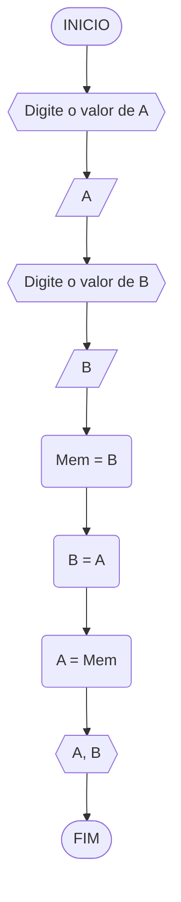
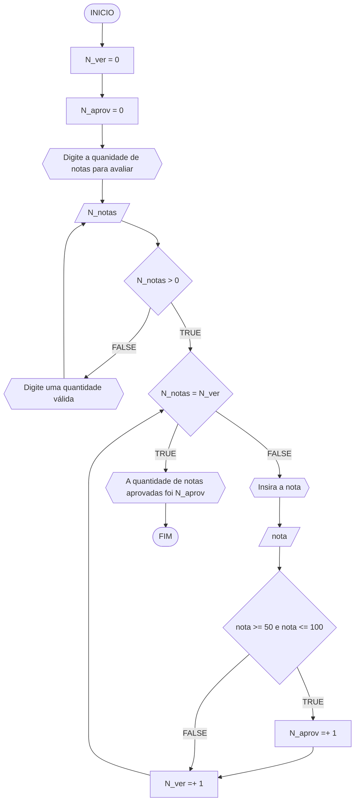
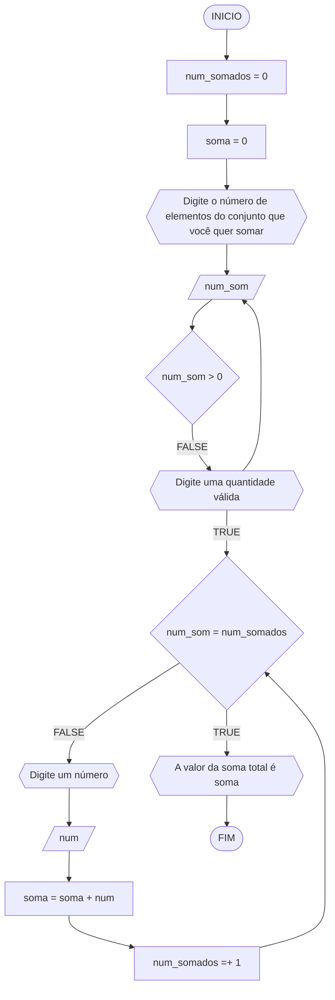
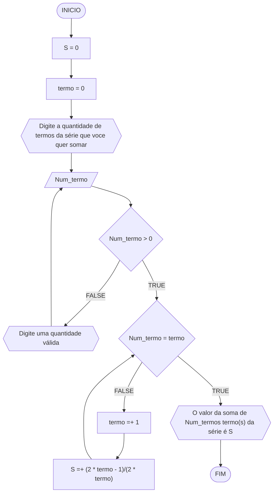
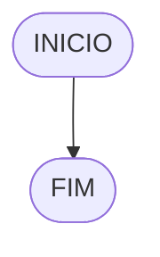

**Curso:** Engenharia da Computação <br>
**Disciplina:** Raciocínio lógico e Algorítimo <br>
**Código/Turma:** T998-21 <br>
**Professor:** Ricardo Carubbi <br>
**Data:** 21/03 <br>
**Aluno(a):** Sérgio de Paiva Ximenes Filho <br>
**Matrícula:** 2410330 <br>

**1a chamada (Sim/Não):** Sim <br>
**2a chamada (Sim/Não):** Não

# Avaliação Diagnóstica 1

## Normas e exigências

Avaliação diagnóstica (**AD**) consiste em exercícios ou projetos desenvolvidos em grupo ao longo da disciplina. <br>
A primeira avaliação diagnóstica (**AD1**) será composta por exercícios e equivale a 30% da nota da primeira avaliação (**AV1**).

Segue abaixo a expressão para o cálculo da **AV1**, sendo sendo **AF1** equivale a primeira avaliação formativa e **AD1**, a primeira avaliação diagnóstica.

$$AV_1 = AF_1 \times 0,30 + AD_1 \times 0,70$$

A **AD1** é formada pela entrega dos exercícios (**EX1**) na data prevista e apresentação (**AP1**) de um dos exercícios escolhido pelo professor.
Segue abaixo a expressão para o cálculo da **AD1**.

$$AD_1 = EX1_1 + AP_1 $$

A **EX1** é avaliada mediante a **correção dos exercícios**, sendo a avaliação no intervalo de 0% (não atende a questão), 50% (atende parcialmente) e 100% (atende em sua totalidade).
Por exemplo, se o exercício equivale a 2 pontos e sua correção atente parcialmente a questão, então sua avaliação deste exercício será 1 ponto.

A **AP1** é avaliada mediante aos pré-requisitos de **clareza, organização e domínio do conteúdo**. Portanto, o aluno deve demonstrar um bom entendimento do algoritmo, explicando seus princípios fundamentais, seu propósito e como ele funciona passo a passo. <br>

A avaliação da **AP1** é apenas considerada no intervalo de 0% (não atende os pré-requisitos), 50% (atende parcialmente) e 100% (atende em sua totalidade).
Por exemplo, se na apresentação do exercício, o aluno atenter parcialmente os pré-requisitos, então sua avaliação da apresentação será 5,0.

## Lista de questões

### Questão 1 - Troca dos valores de duas variáveis (1 ponto)

Dadas duas variáveis, $a$ e $b$, implemente e teste um algoritmo para trocar os valores atribuídos a elas.
#### Fluxograma (0.25 ponto)



#### Pseudocódigo (0.5 ponto)

```
Algoritmo TrocaValores
DECLARE A, B, Mem: float
INICIO
ESCREVA "Digite o valor de A"
LEIA A
ESCREVA "Digite o valor de B"
LEIA B
Mem = B
B = A
A = Mem
ESCREVA A, B
FIM_ALGORITMO
```

#### Teste de mesa (0.25 ponto)

| A  | B | Mem = B | B = A | A = Mem | Saida |
| -- | -- | -- | -- | -- | -- |
| 10 | 4 | 4 | 10 | 4 | 4, 10

### Questão 2 - Contagem (1 ponto)

Dado um conjunto $n$ de notas de alunos em um exame, implemente e teste um algoritmo para fazer uma contagem $cont$ do número de alunos que foram aprovados no exame. 
Será considerado aprovado o aluno que tirar $nota$ 50 ou maior (no intervalo de 0 a 100).

#### Fluxograma (0.25 ponto)



#### Pseudocódigo (0.5 ponto)

```
Algoritimo aprovação
DECLARE N_ver, N_aprov, N_notas, i: Int
	notas: Float
INICIO
N_ver = 0
N_aprov = 0 
ESCREVA "Digite a quanidade de notas para avaliar"
LEIA N_notas
ENQUANTO N_notas <= 0 REPITA
	ESCREVA "Digite uma quantidade válida"
	LEIA N_notas
PARA N_ver DE 0 ATÉ N_notas FAÇA [PASSO 1]
	ESCREVA "Insira a nota"
	LEIA nota
	SE nota >= 50 E nota <= 100
		N_aprov =+ 1
		N_ver =+ 1
	SENÃO
		N_ver =+ 1
	FIM_SE
FIM_PARA
ESCREVA "A quantidade de notas aprovadas foi", N_aprov
FIM_ALGORÍRIMO
```
#### Teste de mesa (0.25 ponto)  
##### Chat GPT
| Iteração | Ação                                              | Entrada/Saída  | N_aprov | N_ver |
|----------|---------------------------------------------------|----------------|---------|-------|
|         | **Inicialização das Variáveis**                   |                | 0       | 0     |
|         | **Entrada do Número de Notas**                    | 5              |         |       |
| 1        | Mensagem: "Insira a nota"                         |                |         |       |
|          | Entrada: nota                                     | 70             |         |       |
|          | Condição SE: 70 >= 50 e 70 <= 100 (verdadeiro)   |                |         |       |
|          |  N_aprov += 1                                    |                | 1       | 1     |
|          |  N_ver += 1                                      |                |         | 1     |
| 2        | Mensagem: "Insira a nota"                         |                |         |       |
|          | Entrada: nota                                     | 30             |         |       |
|          | Condição SE: 30 >= 50 e 30 <= 100 (falso)        |                |         |       |
|          |  N_ver += 1                                      |                |         | 2     |
| 3        | Mensagem: "Insira a nota"                         |                |         |       |
|          | Entrada: nota                                     | 85             |         |       |
|          | Condição SE: 85 >= 50 e 85 <= 100 (verdadeiro)   |                |         |       |
|          |  N_aprov += 1                                    |                | 2       | 3     |
|          |  N_ver += 1                                      |                |         | 3     |
| 4        | Mensagem: "Insira a nota"                         |                |         |       |
|          | Entrada: nota                                     | 95             |         |       |
|          | Condição SE: 95 >= 50 e 95 <= 100 (verdadeiro)   |                |         |       |
|          |  N_aprov += 1                                    |                | 3       | 4     |
|          |  N_ver += 1                                      |                |         | 4     |
| 5        | Mensagem: "Insira a nota"                         |                |         |       |
|          | Entrada: nota                                     | 40             |         |       |
|          | Condição SE: 40 >= 50 e 40 <= 100 (falso)        |                |         |       |
|          |  N_ver += 1                                      |                |         | 5     |
| -        | **Saída de Resultados**                           |                |         |       |
| -        | Mensagem: "A quantidade de notas aprovadas foi 3"|                |         |       |


### Questão 3 - Soma de um conjunto de números (1 ponto)

Dado um conjunto de $n$ números, implemente e teste um algoritmo para calcular a soma desses números. <br>
Aceite apenas $n$ maior ou igual a zero.

#### Fluxograma (0.25 ponto)



#### Pseudocódigo (0.5 ponto)

```
Algoritmo soma_de_valores
DECLARE num_somados, num_soma: Int
	num, soma: Float
INICIO
soma = 0
ESCREVA "Digite o número de elementos do conjunto que você quer somar"
LEIA num_soma
ENQUANTO num_soma <= 0 FAÇA
	ESCREVA "Digite uma quantidade válida"
	LEIA num_soma
FIM_ENQUANTO
PARA num_somados DE 0 até Num_soma [PASSO 1] FAÇA
	ESCREVA "Digite um número"
	LEIA num
	soma =+ num
FIM_PARA
ESCREVA "O valor da soma total é", soma
FIM_ALGORITMO
```

#### Teste de mesa (0.25 ponto)
##### Chat GPT

| Iteração | Ação                                              | Entrada/Saída | soma | num_somados |
|----------|---------------------------------------------------|---------------|------|-------------|
| -        | **Inicialização das Variáveis**                   |               | 0    | 0           |
| -        | **Entrada do Número de Elementos a Somar**        | 7             |      |             |
| 1        | Mensagem: "Digite um número"                      |               |      |             |
|          | Entrada: num                                      | 0.5           |      |             |
|          |  soma += num                                     |               | 0.5  |             |
|          |  num_somados += 1                                |               |      | 1           |
| 2        | Mensagem: "Digite um número"                      |               |      |             |
|          | Entrada: num                                      | -1.25         |      |             |
|          |  soma += num                                     |               | -0.75|             |
|          |  num_somados += 1                                |               |      | 2           |
| 3        | Mensagem: "Digite um número"                      |               |      |             |
|          | Entrada: num                                      | 2.75          |      |             |
|          |  soma += num                                     |               | 2    |             |
|          |  num_somados += 1                                |               |      | 3           |
| 4        | Mensagem: "Digite um número"                      |               |      |             |
|          | Entrada: num                                      | 0             |      |             |
|          |  soma += num                                     |               | 2    |             |
|          |  num_somados += 1                                |               |      | 4           |
| 5        | Mensagem: "Digite um número"                      |               |      |             |
|          | Entrada: num                                      | -3.5          |      |             |
|          |  soma += num                                     |               | -1.5 |             |
|          |  num_somados += 1                                |               |      | 5           |
| 6        | Mensagem: "Digite um número"                      |               |      |             |
|          | Entrada: num                                      | 1.75          |      |             |
|          |  soma += num                                     |               | 0.25 |             |
|          |  num_somados += 1                                |               |      | 6           |
| 7        | Mensagem: "Digite um número"                      |               |      |             |
|          | Entrada: num                                      | -2.25         |      |             |
|          |  soma += num                                     |               | -2    |             |
|          |  num_somados += 1                                |               |      | 7           |
| -        | **Saída de Resultados**                           |               |      |             |
| -        | Mensagem: "O valor da soma total é -2"            |               |      |             |


### Questão 4 - Cálculo de uma série (1 ponto)

Calcular o valor de S, conforme definido pela seguinte série infinita:

$$ S = \frac{1}{2} + \frac{3}{4} + \frac{5}{6} + \frac{7}{8} + \dots $$

#### Fluxograma (0.25 ponto)



#### Pseudocódigo (0.5 ponto)
```
Algoritmo soma_da_serie
DECLARE Num_termo, termo: Int
	S: Float
INICIO
S = 0
ESCREVA "Digite a quantidade de termos da série que você quer somar"
LEIA Num_termo
ENQUANTO Num_termo < 0 FAÇA
	ESCREVA "Digite uma quantidade válida"
	LEIA Num_termo
FIM_ENQUANTO
PARA termo DE 1 ATÉ Num_termo [PASSO 1] FAÇA
	S =+ (2 * termo - 1)/(2 * termo)
FIM_PARA
ESCREVA "O valor da soma de", Num_termo, "termo(s) da série é", S
FIM_ALGORITMO
```
#### Teste de mesa (0.25 ponto)

| nome_coluna1 | nome_coluna2 | nome_coluna3 | nome_coluna4 | nome_coluna5 | 
|      --      |      --      |      --      |      --      |      --      | 
| Adicione     | espaço       | se quiser    |  alinhar     | as barras    |
| verticais,   | mas          | não é        | obrigatório. | Entendido ?  |

### Questão 5 - Cálculo fatorial (2 pontos)

Dado um número $n$, calcular o fatorial de $n$ (escrito como $n!$), onde $n ≥ 0$.

#### Fluxograma (0.5 ponto)


#### Pseudocódigo (1.0 ponto)

```
Algoritmo ContaAprovacoes
FIM_ALGORITMO
```

#### Teste de mesa (0.5 ponto)

| nome_coluna1 | nome_coluna2 | nome_coluna3 | nome_coluna4 | nome_coluna5 | 
|      --      |      --      |      --      |      --      |      --      | 
| Adicione     | espaço       | se quiser    |  alinhar     | as barras    |
| verticais,   | mas          | não é        | obrigatório. | Entendido ?  |

### Questão 6 - Geração da sequência de Fibonacci (2 pontos)

Gerar e imprimir os $n$ primeiros termos da sequência de Fibonacci, onde $n ≥ 1$. <br>
Os primeiros termos são: $0, 1, 1, 2, 3, 5, 8, 13, \dots$ <br>
Cada termo, além dos dois primeiros, é derivado da soma dos seus dois antecessores mais próximos.

#### Fluxograma (0.5 ponto)


#### Pseudocódigo (1.0 ponto)

```
Algoritmo ContaAprovacoes
FIM_ALGORITMO
```
#### Teste de mesa (0.5 ponto)

| nome_coluna1 | nome_coluna2 | nome_coluna3 | nome_coluna4 | nome_coluna5 | 
|      --      |      --      |      --      |      --      |      --      | 
| Adicione     | espaço       | se quiser    |  alinhar     | as barras    |
| verticais,   | mas          | não é        | obrigatório. | Entendido ?  |

### Questão 7 - Inversão dos dígitos de um número inteiro (2 pontos)

Inverter a ordem dos dígitos de um número inteiro positivo.

#### Fluxograma (0.5 ponto)



#### Pseudocódigo (1.0 ponto)

```
Algoritmo ContaAprovacoes
FIM_ALGORITMO
```

#### Teste de mesa (0.5 ponto)

| nome_coluna1 | nome_coluna2 | nome_coluna3 | nome_coluna4 | nome_coluna5 | 
|      --      |      --      |      --      |      --      |      --      | 
| Adicione     | espaço       | se quiser    |  alinhar     | as barras    |
| verticais,   | mas          | não é        | obrigatório. | Entendido ?  |
