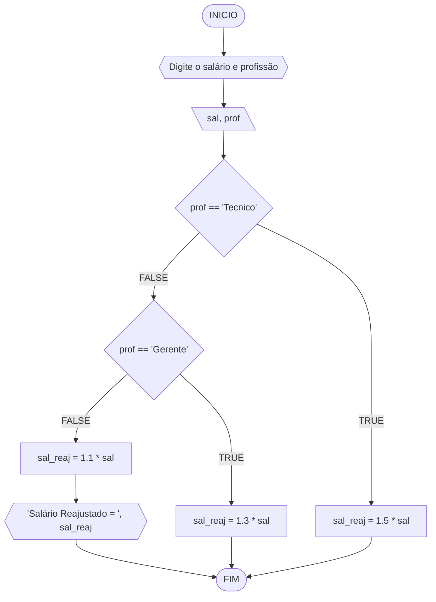
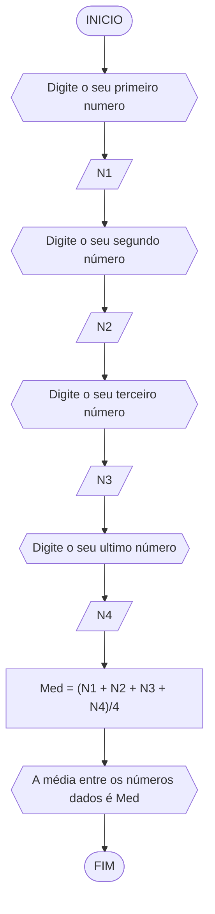
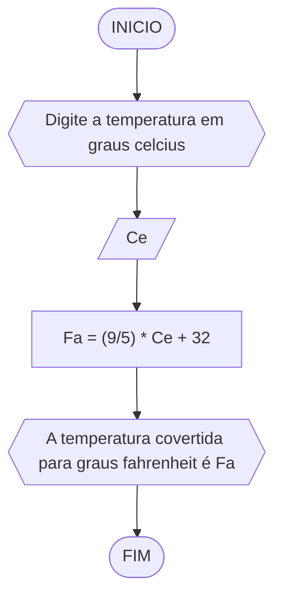
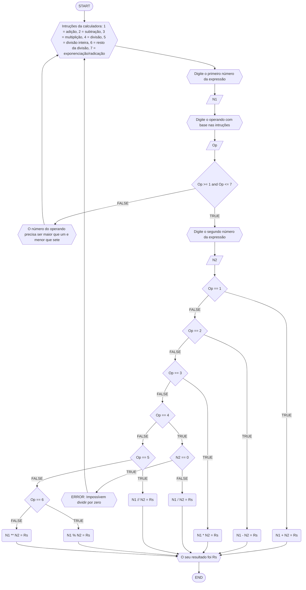
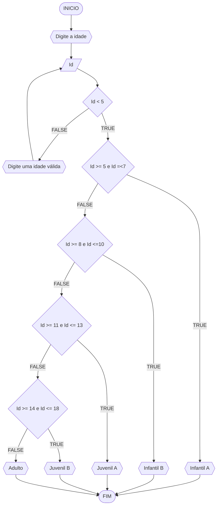

# UNIFOR
**Nome**: Sergio de Paiva Ximenes Filho <br>
**Disciplina**: Raciocínio Lógico Algorítmo

## Exercício exemplo
Represente, em fluxograma e pseudocódigo, um algoritmo para calcular o adicional de salário de funcionário por cargo de uma empresa fictícia. Sabe-se que os funcionários de cargo técnico receberão reajuste de 50%, cargo de gerência, um reajuste de 30% e demais, um reajuste de 10%. 

#### Fluxograma


#### Pseudocódigo
```
1  ALGORITMO calReajuste
2  DECLARE  sal, sal_reaj: real, prof: caractere
3  INICIO
4  LEIA sal, prof
5  ESCOLHA
6   CASO prof == “Técnico”		// caso 1
7     sal_reaj ← 1.5 * sal
8   CASO prof = “Gerente”		// caso 2
9     sal_reaj ← 1.3 * sal
10  SENÃO
11    sal_reaj ← 1.1 * sal
12 FIM_ESCOLHA
13 ESCREVA “Salário Reajustado = “, sal_reaj
14 FIM
```

#### Teste
| sal | prof | prof == “Técnico” | prof = “Gerente” | sal_reaj | Saída |
| -- | -- | -- | -- | -- | -- |
| 1000 | Técnico | V | F | 1500 | “Salário Reajustado = 1500“ |
| 2000 | Gerente | F | V | 2600 | “Salário Reajustado = 2600“ |
| 9000 | Diretor | F | F | 9900 | “Salário Reajustado = 9900“ |

## Lista de exercícios 02

### Exercício 01 (2.5 pontos)
Calcule a média de quatro números inteiros dados.

#### Fluxograma (1.0 ponto)



#### Pseudocódigo (1.0 ponto)

```
Algoritmo Media
DECLARE N1, N2, N3, N4: int
	Med: float
INICIO
ESCREVA "Digite o seu primeiro número"
LEIA N1
ESCREVA "Digite o seu segundo número"
LEIA N2
ESCREVA "Digite o seu terceiro número"
LEIA N3
ESCREVA "Digite o seu ultimo número"
LEIA N4
Med = (N1 + N2 + N3 + N4)/4
ESCREVA "A média dos números dados é", Med
FIM_ALGORITMO
```

#### Teste de mesa (0.5 ponto)

|N1|N2|N3|N4|Med = (N1 + N2 + N3 + N4)/4|Saída| 
|--|--|--|--|--|--|
|-80|97|45|-3|-7.25|A média dos números dados é Med|


### Exercício 02 (2.5 pontos)
Leia uma temperatura dada em Celsius (C) e imprima o equivalente em Fahrenheit (F). (Fórmula de conversão: F = (9/5) * C + 32)

#### Fluxograma (1.0 ponto)



#### Pseudocódigo (1.0 ponto)

```
Algoritmo ConverteCelsiusFarenheit
DECLARE Ce, Fe: float
INICIO
ESCREVA "Digite a temperatura em graus celcius"
LEIA Ce
Fa = (9/5) * Ce + 32
ESCREVA "A temperatura covertida para graus fahrenheit é", Fa
FIM_ALGORITMO
```

#### Teste de mesa (0.5 ponto)

|Ce|Fa = (9/5) * Ce + 32|Saída|
|--|--|--| 
|0|32|A temperatura covertida para graus fahrenheit é 32|

### Exercício 03 (2.5 pontos)
Receba dois números reais e um operador e efetue a operação correspondente com os valores recebidos (operandos). 
O algoritmo deve retornar o resultado da operação selecionada simulando todas as operações de uma calculadora simples.

#### Fluxograma (1.0 ponto)



#### Pseudocódigo (1.0 ponto)

```
 Algoritimo Calculadora
 DECLARE N1,N2,Rs: float
	 Op: int
 INICIO
 ESCREVA "Intruções da calculadora: 1 = adição, 2 = subtração, 3 = multiplição, 4              
	  = divisão, 5 = divisão inteira, 6 = resto da divisão, 7 = exponenciação/radicação" 
 ESCREVA "Digite o primeiro número da expressão"
 LEIA N1
 ESCREVA "Digite o operando com base nas intruções"
 LEIA Op
 SE Op >= 1 e Op <= 7
	ESCREVA "Digite o segundo número da expressão"
	LEIA N2
	ESCOLHA
		CASO Op =  1
			Rs = N1 + N2
		CASO Op =  2
			Rs = N1 - N2
		CASO Op = 3
			Rs = N1 * N2
		CASO Op = 4
		        ENQUANTO N2 == 0 FAÇA
				ESCREVA "ERROR: impossível dividir por zero, digite um novo denominador"
				LEIA N2
			FIM_ENQUANTO
			Rs = N1 / N2
		CASO Op = 5
			ENQUANTO N2 == 0 FAÇA
				ESCREVA "ERROR: impossível dividir por zero, digite um novo denominador"
				LEIA N2
			FIM_ENQUANTO
			Rs = N1 // N2
		CASO Op = 6
			Rs = N1 % N2
		SENÃO
 			Rs = N1 ** N2   
	FIM_ESCOLHA 
ESCREVA "O seu resultado foi", Rs    
FIM_ALGORÍTIMO
```

#### Teste de mesa (0.5 ponto)

|N1|Op|N2|Op == 1|Op == 2|Op == 3|Op == 4|N2 == 0|Op == 5|N2 == 0|Op == 6|Rs|Saída| 
|--|--|--|--|--|--|--|--|--|--|--|--|--|
|8|1|10|V|-|-|-|-|-|-|-|18|O seu resultado foi 18|
|20|2|-20|F|V|-|-|-|-|-|-|0|O seu resultado foi 0|
|87|3|0|F|F|V|-|-|-|-|-|0|O seu resultado foi 0|
|0.2|4|0.1|F|F|F|V|F|-|-|-|2|O seu resultado foi 2|
|120|4|0|F|F|F|V|V|-|-|-|-|ERROR: impossível dividir por zero, digite um novo denominador|
|25|5|7|F|F|F|F|-|V|F|-|3|O seu resultado foi 3|
|37|5|0|F|F|F|F|-|V|V|-|-|ERROR: impossível dividir por zero, digite um novo denominador|
|31|6|2|F|F|F|F|-|F|-|V|1|O seu resultado é 1|
|2|7|5|F|F|F|F|-|F|-|F|32|O seu resultado é 32|


### Exercício 04 (2.5 pontos)
Elaborar um algoritmo que, dada a idade, classifique nas categorias: infantil A (5 - 7 anos), infantil B (8 -10 anos), juvenil A (11 - 13 anos), juvenil B (14 -17 anos) e adulto (maiores que 18 anos).

#### Fluxograma (1.0 ponto)



#### Pseudocódigo (1.0 ponto)

```
Algoritmo ClassificaCategoria
FIM_ALGORITMO
```

#### Teste de mesa (0.5 ponto)

| nome_coluna1 | nome_coluna2 | nome_coluna3 | nome_coluna4 | nome_coluna5 | 
|      --      |      --      |      --      |      --      |      --      | 
| Adicione     | espaço       | se quiser    |  alinhar     | as barras    |
| verticais,   | mas          | não é        | obrigatório. | Entendido ?  |
